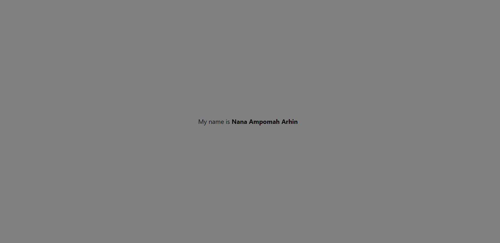

# Assignment 2

## Student ID : 11019735

This is a react native blank template project buit using Expo CLI. In the project, the background color of the View component in the App.js file was changed from its default color to grey. The Text component was also edited to display "My name is Nana Ampomah Arhin". The font size of the text was then increased to 24, after which "Nana Ampomah Arhin" in the sentence "My name is Nana Ampomah Arhin" was made bold.

# Screenshot

